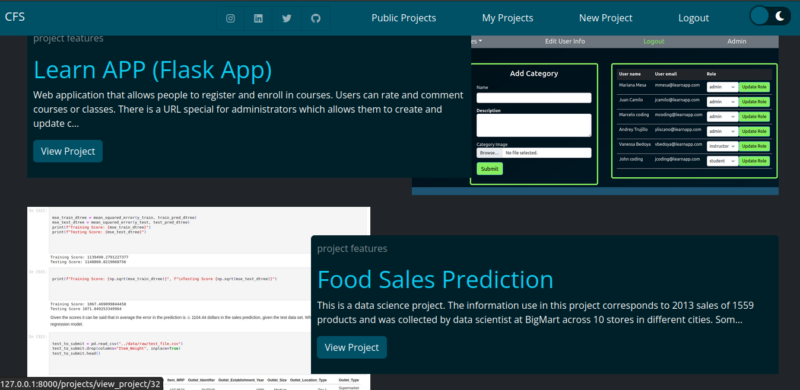

# CFS Creative Full-Stack (On development)

## What is this?
This app was created to show the projects I've worked on and the technologies I've used. It's a full-stack app that uses Django, JavaScript, Bootstrap, PostgreSQL. You can see the projects in the `public projects` section.
<!-- It's possible to to register and login to the app, and then create, edit, and delete projects, but once you log out, the info will be deleted from the database, the information related to the projects also will be deleted.so, keep that in mind. -->

## What will you find in this app?
- A project detail page with the project's info.
- A home page with a list of the projects you've created.

## Projects detail page

## Responsive

## Dark and Light mode

Full-stack Copilot is an app created with django and bootstrap. Still in development. It implements a lot of features that are useful for managing projects. The storage of the data is done with postgreSQL. The app is responsive and it has a dark and light mode. It also apply OOP to handle file and store requirements and To-Do lists of projects.